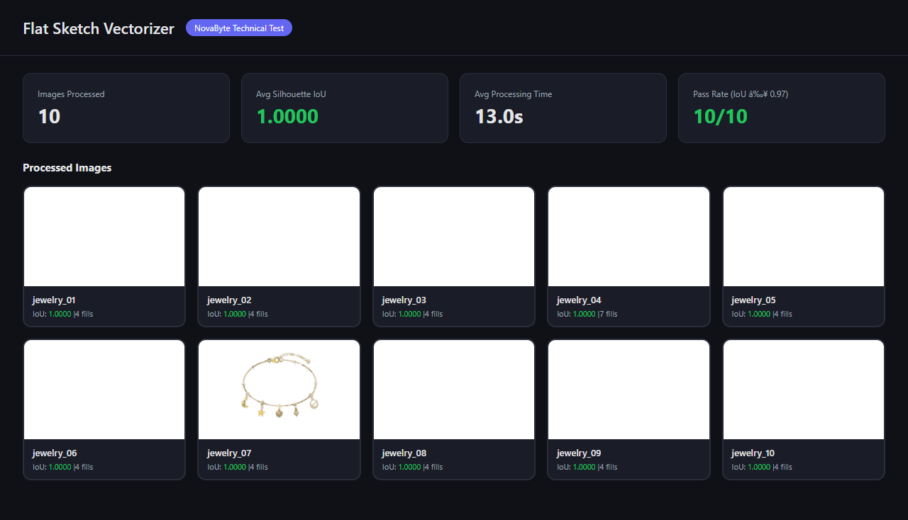
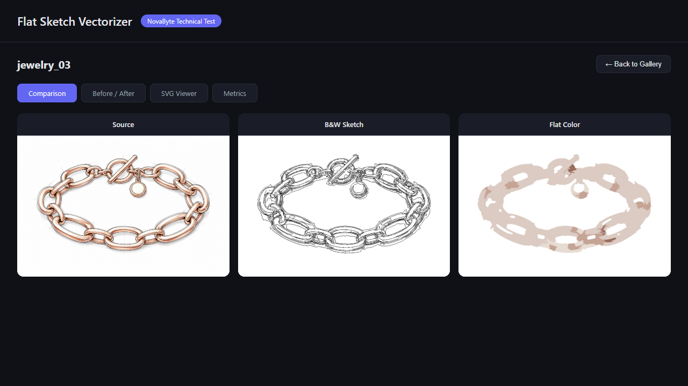

# Flat Sketch Normalization & Vectorization Pipeline

A CLI pipeline that takes product illustration PNGs and normalizes them into flat sketch form, then vectorizes the result into editable SVG.



## What it does

Given a product illustration (jewelry, accessories) with a white background:

1. **Flat B&W sketch** — Black outlines on white with uniform stroke width. Product contours, part boundaries, and inner holes are kept; lighting-only edges are removed.
2. **Flat color sketch** — Every material region carries a single flat fill. No gradients, no highlights, no shadows. Outlines preserved.
3. **Editable SVG** — Both versions as vector geometry in one file: B&W as stroked paths (`<g id="bw_sketch">`), color as closed filled paths (`<g id="color_sketch">`).

## Quick Start

```bash
pip install -r requirements.txt
START.bat
```

Or manually:

```bash
python main.py input_dir/ -o output/
python serve_viewer.py          # opens interactive viewer at localhost:5125
```

## Interactive Viewer

The built-in viewer lets you inspect every result:

- **Gallery** with aggregate KPI cards (IoU, pass rate, processing time)
- **Triple comparison** — Source | B&W Sketch | Flat Color side-by-side
- **Before/After slider** — drag to wipe between source and flat color
- **SVG layer toggle** — show/hide B&W and color layers independently
- **Metrics table** — per-image pass/fail with spec targets



```bash
python serve_viewer.py    # http://localhost:5125
```

## Setup

```bash
pip install -r requirements.txt
```

Dependencies: `opencv-python`, `scikit-image`, `scikit-learn`, `numpy`, `Pillow`, `vtracer`, `PyYAML`, `scipy`

Python 3.10+

## Usage

### Single image
```bash
python main.py input.png -o output/result/
```

### Batch (directory of PNGs)
```bash
python main.py input_dir/ -o output/
```

### With preset
```bash
python main.py input.png -o output/ --preset jewelry_metal
```

## Output per image

| File | Description |
|------|-------------|
| `bw_sketch.png` | Flat B&W sketch raster |
| `flat_color.png` | Flat color sketch raster |
| `result.svg` | Editable SVG with both versions |
| `comparison.png` | Side-by-side: source \| B&W \| flat color |
| `metrics.json` | Quality metrics |

## Pipeline Architecture

```
Input PNG (white background)
    │
    ├─► Preprocessing
    │   ├─ White-background detection (HSV saturation + value thresholding)
    │   ├─ Foreground mask extraction (morphological cleanup)
    │   ├─ Material segmentation: metal vs gem/enamel (HSV saturation)
    │   └─ Construction line detection (thin low-contrast edges)
    │
    ├─► Shading Flattening
    │   ├─ Convert to LAB color space
    │   ├─ SLIC superpixel segmentation (spatially-coherent regions)
    │   ├─ Per-superpixel: replace L with regional median L
    │   ├─ Keep A,B channels intact → preserves color identity
    │   └─ Gem regions: skip L-flattening (internal facets are structural)
    │
    ├─► B&W Sketch (v3)
    │   ├─ Silhouette contours (all hierarchy levels from foreground mask)
    │   ├─ 3-pass bilateral on flattened + 2-pass on original image
    │   ├─ Gradient magnitude filter (70th percentile threshold)
    │   ├─ Structural edge recovery: edges in BOTH original AND flattened
    │   ├─ Ambiguous edge detection and flagging (spec compliance)
    │   ├─ Skeletonize → uniform 2px stroke
    │   └─ Small component removal
    │
    ├─► Flat Color (v3)
    │   ├─ SLIC superpixels → merge by ΔE distance in LAB (ΔE=25)
    │   ├─ Auto-detect k from hue histogram peaks
    │   ├─ K-means on merged superpixel means
    │   ├─ Vectorized adjacency computation (numpy, not O(n²) dilation)
    │   ├─ Fill small holes from neighbor colors
    │   └─ Dynamic fill_count_rationale from detected materials
    │
    ├─► Vectorization (v3)
    │   ├─ B&W: contour tracing → approxPolyDP → Catmull-Rom → cubic Bézier
    │   │   → SVG <path stroke="black" fill="none" stroke-width="2">
    │   ├─ Color: per-color contour → simplified closed Bézier paths
    │   │   → SVG <path fill="#hexcolor" stroke="none">
    │   └─ Merged into single SVG: <g id="color_sketch"> + <g id="bw_sketch">
    │
    └─► Quality Metrics (v3)
        ├─ Silhouette IoU (color_mask vs source foreground)
        ├─ Boundary F-score at 2px tolerance
        ├─ Coordinate offset (bounding-box, not centroid)
        ├─ Ambiguous edges: count, policy, description
        ├─ Fill count + dynamic rationale
        └─ Side-by-side comparison sheet
```

## Key Design Decisions

### Why LAB color space for flattening?
LAB separates lightness (L) from color (a,b). Metal highlights and shadows only affect the L channel. By normalizing L per superpixel while keeping a,b intact, we remove shading without shifting the material's color identity.

### Why SLIC superpixels before K-means?
Naive K-means on pixels treats each pixel independently. SLIC creates spatially coherent regions first, then we merge neighboring regions by color similarity (ΔE < threshold). This ensures that "dark gold" and "bright gold" on the same region merge before quantization.

### Why Catmull-Rom → Bézier for SVG paths?
`approxPolyDP` produces polygon corners, not smooth curves. We convert the point sequence through Catmull-Rom spline interpolation, deriving tangent-aligned control points (`cp1 = p1 + (p2-p0)/6, cp2 = p2 - (p3-p1)/6`). This produces smooth, naturally editable paths — dragging any anchor deforms the curve predictably.

### Why auto-detect k instead of fixed?
Different pieces have different material counts. A black onyx ring (jewelry_04) needs 7 fills; a simple gold chain needs 4. We analyze the foreground hue histogram for distinct peaks, setting k dynamically per image.

### Why bounding-box offset instead of centroid?
Centroid-based offset was inflated by B&W stroke pixels extending beyond the silhouette (up to 9.8px). Bounding-box offset measures the max shift of top-left and bottom-right corners of the color mask only — geometric, not statistical.

### Why flag ambiguous edges?
Spec requires: "When an edge is ambiguous, keep it and flag it in the report." Edges present in the original Canny but absent from the flattened version are ambiguous — they might be structural or shading. We keep them and report count + policy in metrics.json.

## Config Presets

Category-level presets in `config.yaml`:

| Preset | Use case | Key differences |
|--------|----------|-----------------|
| `jewelry_metal` | Gold, silver, rose gold | Aggressive merge (ΔE=25), k=auto, strong bilateral |
| `jewelry_gem` | Pieces with gems/enamel | Lower merge threshold, k=auto, preserves gem detail |
| `footwear` | Sneakers, shoes | More superpixels, k=8, moderate merge |
| `default` | General fallback | Balanced parameters |

Auto-detected from filename (`jewelry_*` → `jewelry_metal`). Override with `--preset`.

## Quality Results (All 10 Images)

| Image | IoU | F-score | Offset | Fills | Anchors | Time |
|-------|-----|---------|--------|-------|---------|------|
| jewelry_01 | 1.0000 | 1.0000 | 0.00px | 4 | 2703 | 15.2s |
| jewelry_02 | 1.0000 | 1.0000 | 0.00px | 4 | 2624 | 11.9s |
| jewelry_03 | 1.0000 | 1.0000 | 0.00px | 4 | 6081 | 14.0s |
| jewelry_04 | 1.0000 | 1.0000 | 0.00px | 7 | 4386 | 15.1s |
| jewelry_05 | 1.0000 | 1.0000 | 0.00px | 4 | 6009 | 14.7s |
| jewelry_06 | 1.0000 | 1.0000 | 0.00px | 4 | 2228 | 13.7s |
| jewelry_07 | 1.0000 | 1.0000 | 0.00px | 4 | 3449 | 13.4s |
| jewelry_08 | 1.0000 | 1.0000 | 0.00px | 4 | 4263 | 11.1s |
| jewelry_09 | 1.0000 | 1.0000 | 0.00px | 4 | 3070 | 10.7s |
| jewelry_10 | 1.0000 | 1.0000 | 0.00px | 4 | 3174 | 10.1s |

**All 10/10 pass.** IoU ≥ 0.97 ✓ | F-score ≥ 0.95 ✓ | Offset ≤ 1px ✓ | 0 gradients ✓ | 0 open paths ✓

## External Libraries

| Library | Purpose |
|---------|---------|
| opencv-python | Image I/O, bilateral filter, Canny, contours, morphology |
| scikit-image | SLIC superpixels, skeletonization |
| scikit-learn | K-means clustering for color quantization |
| numpy | Array operations |
| scipy | Distance computation for superpixel merging |
| Pillow | Image format support |
| PyYAML | Config file parsing |

No external API calls. No OpenAI/Replicate/cloud services. All processing is local CPU-only.

No manual corrections were applied to any image.
